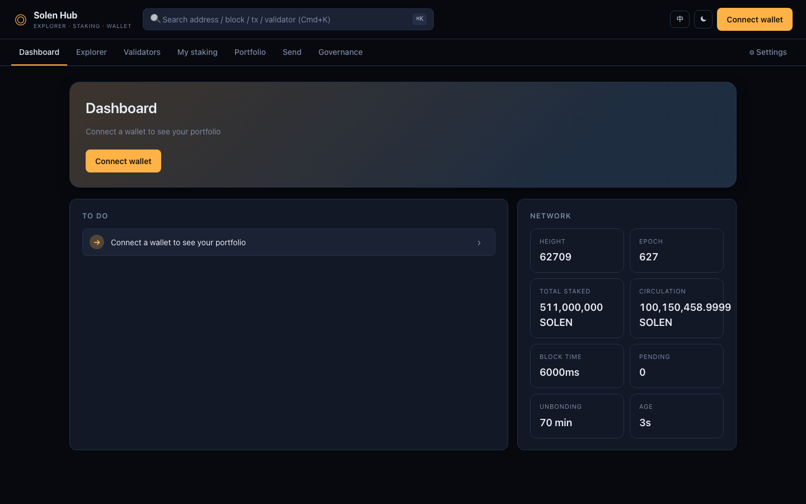
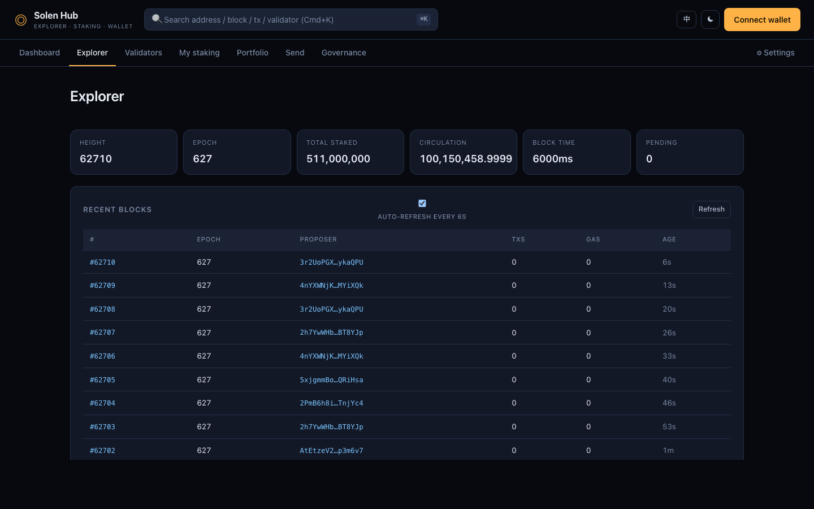
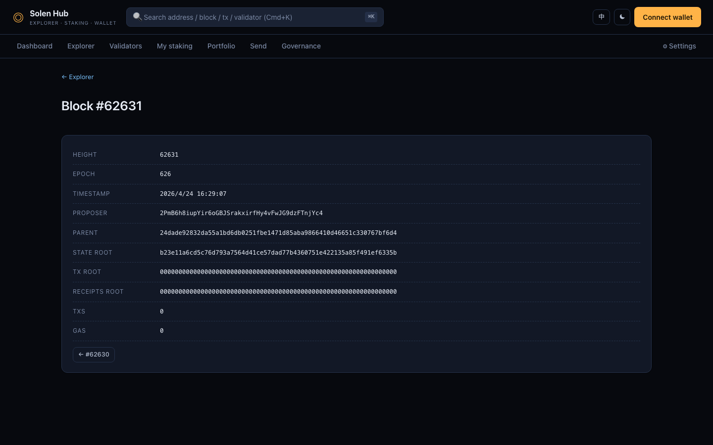
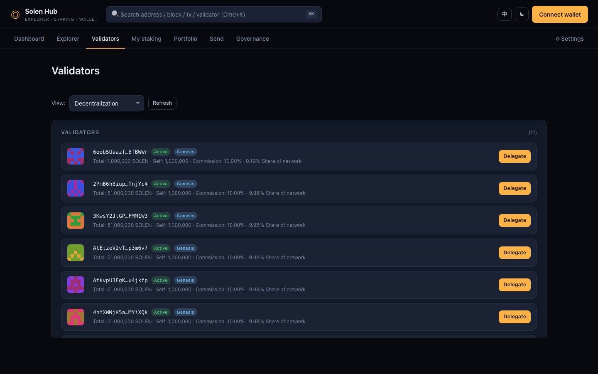
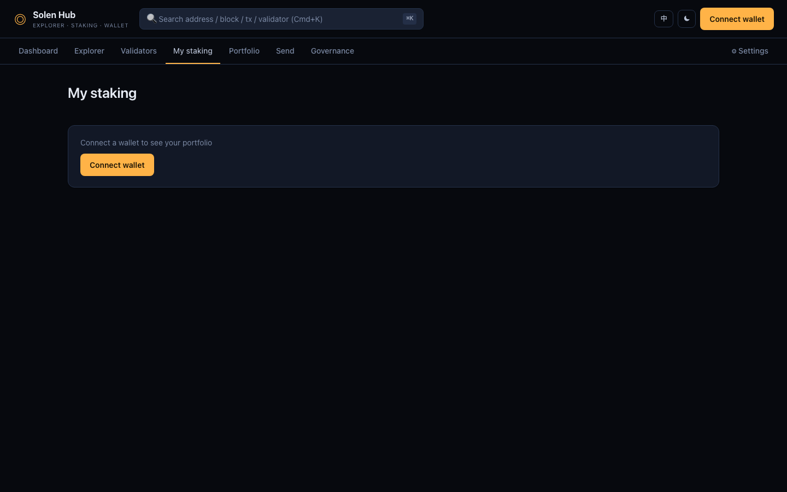
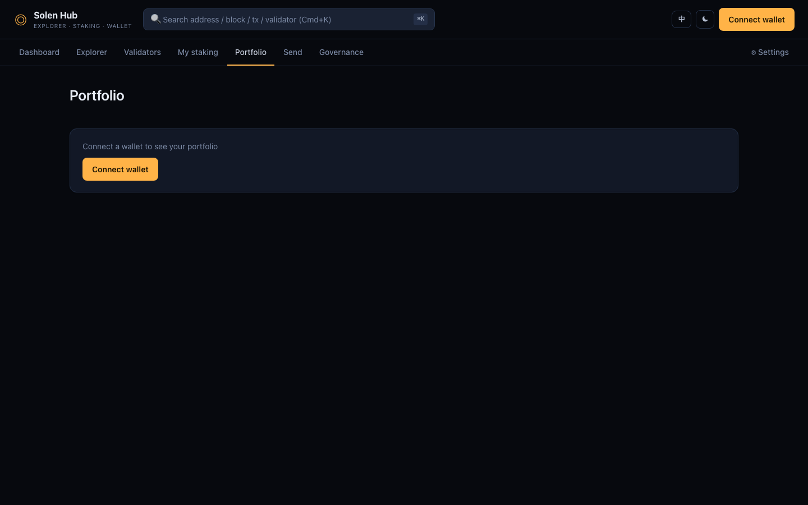
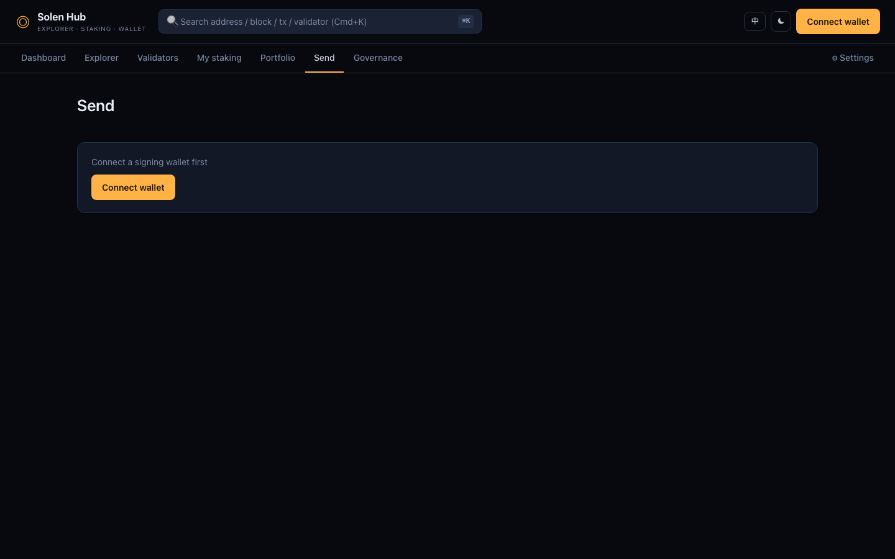
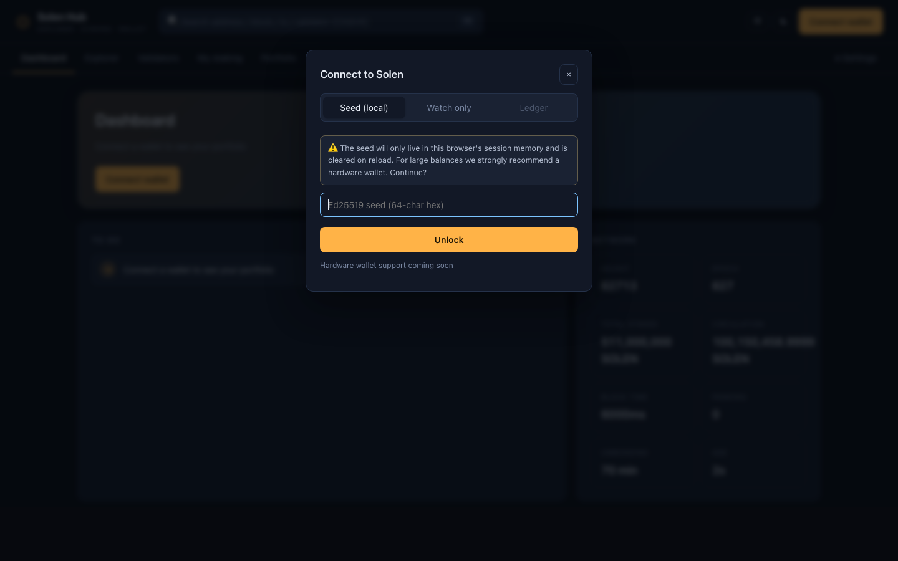
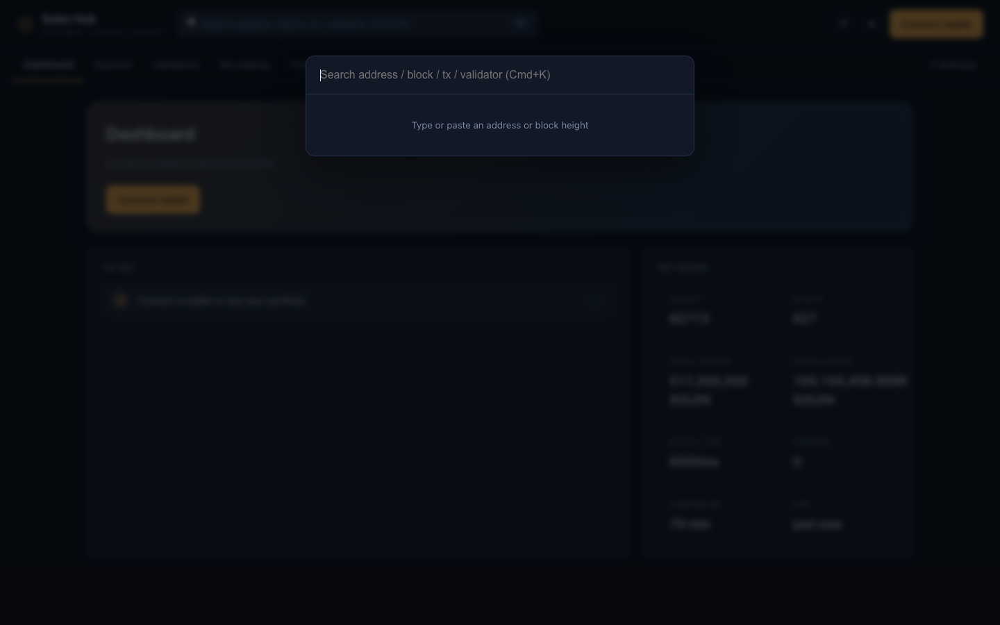
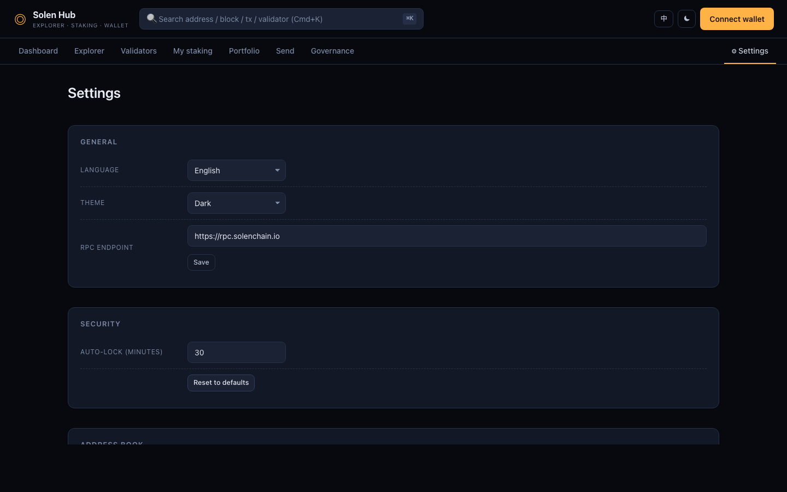

# Solen Hub

**A Solen blockchain portal for everyday users** — explorer, staking, transfers, governance, wallet — all in one place.

   

---

## ⚠️ Beta Disclaimer

> - Solen Hub is **Beta** software and **has not** been independently audited.
> - Do **not** use it with funds you cannot afford to lose. Test with small amounts first.
> - Seeds / keys live **only in browser session memory**; a refresh, lock, or tab close wipes them. Nothing is ever sent to a server and the maintainers cannot access your keys.
> - Transactions may still fail after signing due to network / chain-state / RPC issues. Always review the `Simulate` result before broadcasting.
> - The maintainers accept **no liability** for any direct or indirect loss resulting from use (or non-use) of this software.
> - This project is an independent community build and is **not officially affiliated** with the Solen Foundation unless stated otherwise.

---

## 🎯 TL;DR

Solen Hub bundles the following capabilities into a single web app. Keys stay 100% local. It connects to **Solen mainnet** (`https://rpc.solenchain.io`) by default:

- Block / transaction / account **explorer**
- **Validator leaderboard** + one-click delegation wizard (delegate / undelegate / withdraw, with simulation preview)
- End-to-end **staking flow** with unbonding-period visualization and slashing risk notes
- **Portfolio panel** (spot / staked / vesting / total, with CSV export)
- **Send** — plain transfers (with simulation + self-send and format validation)
- **Governance** — proposal browser when the node exposes governance RPC
- **Settings** — i18n (EN / 简中), dark / light theme, custom RPC, auto-lock, address book
- **Cmd/Ctrl+K** global search: paste a hex32 → account / validator, a number → block

---

## 📸 Screenshots

Screenshots live under `docs/screenshots/*.png`.

| Page | Description | Preview |
|---|---|---|
| Dashboard | Asset summary + to-do cards + network overview |  |
| Explorer | Latest 20 blocks + auto-refresh + 6-metric network card |  |
| Block detail | Per-block state/tx/receipt roots + proposer |  |
| Validators | Validator leaderboard (sort by decentralization / total stake / commission) |  |
| Staking wizard | Delegation wizard — signing enabled only after Simulate succeeds |  |
| Portfolio | Spot / staked / vesting / total + CSV export |  |
| Send | Transfer with simulate preview and self-send guard |  |
| Wallet modal | Connection tabs (Seed / Watch / Ledger placeholder) |  |
| Cmd+K | Global search palette |  |
| Settings | Language / theme / RPC / auto-lock / address book |  |

> **Refreshing screenshots**: run `npm run dev` locally, capture in-browser, save to `docs/screenshots/`. 1440×900 or larger in the default dark theme looks best.

---

## 🚀 Quick start

**Prerequisites**: Node.js ≥ 18, npm ≥ 9. This repo does **not** consume `@solen/wallet-sdk` from npm — it references a sibling `vendor/wallet-sdk-ts/` built from the [Solen-Blockchain/solen](https://github.com/Solen-Blockchain/solen) monorepo's `sdks/wallet-sdk-ts`.

```bash
# 1) (If not already vendored) build and vendor the SDK
git clone https://github.com/Solen-Blockchain/solen /tmp/solen
cd /tmp/solen/sdks/wallet-sdk-ts && npm install && npm run build
# Copy the built package to ../vendor/wallet-sdk-ts/ relative to this repo

# 2) Start the Hub
cd solen-hub
npm install
npm run dev
# → http://127.0.0.1:5174/
```

Other commands:

```bash
npm run build    # output to dist/
npm run preview  # preview production build (port 4176)
npx tsc --noEmit # type-check only
```

The default RPC points at Solen mainnet `https://rpc.solenchain.io`. You can switch to any self-hosted or testnet node from Settings.

---

## ✨ Features

### Wallet / Account
- **Three connection modes**
  - **Local seed** (64-hex, memory-only, forced security prompt)
  - **Watch mode** (read-only, no key required)
  - **Ledger** / WalletConnect (UI placeholders, awaiting upstream support)
- **Identicon avatars** derived from address hash
- **Auto-lock** (30 min idle by default, configurable or off)
- **Wallet capsule dropdown**: copy, view account, lock, disconnect
- **Toast feedback**: connect success / signed broadcast / simulation failure / copy

### Explorer
- Latest **20 blocks**, supports infinite "load more"
- **6-second auto-refresh** (can be turned off)
- **Block detail**: all roots, proposer, timestamp, one-click copy
- **Account detail**: balance / nonce / staked / delegation list
- All addresses / block numbers are deep-linkable (`#/block/123`, `#/account/abc...`)

### Validators & Staking
- **Sort modes**
  - Decentralization score (default — favors smaller nodes with lower commission)
  - Total stake
  - Commission
- Each validator row shows: identicon, active / offline / genesis pill, share of network, self / delegated / total stake, commission
- **Delegation wizard**
  - Pick validator + amount
  - **Sign button enabled only after `Simulate` succeeds**
  - Toast feedback after broadcast
  - Unbonding period computed dynamically (`unbonding_period_epochs × epoch_length × block_time_ms`)
  - Slashing / misbehavior risk note
- **Undelegate**: modal form pre-filled with current delegation
- **Withdraw**: surfaces only when pending undelegation exists

### Portfolio
- Four cards: spot / staked / vesting pending / total
- Vesting schedule table (start / end / total / released / %)
- **CSV export** (address, balances, full delegation breakdown)

### Send
- Plain Transfer action
- `Simulate` preview → sign button enables only on success
- **Live warnings** for self-send / invalid address
- Address-book dropdown selection

### Governance
- When the node exposes `solen_getGovernanceProposals`: renders proposal cards with YES-vote progress bars
- Otherwise **degrades gracefully** to a warning banner — never crashes

### Settings & Address Book
- Language toggle (English / 简体中文, defaults to English)
- Theme (dark / light / follow system)
- Custom RPC URL
- Auto-lock minutes
- Local address book CRUD (add / edit / remove notes)
- One-click reset

### Global
- **Cmd / Ctrl + K** command palette
  - Paste hex32 → jump to account / validator
  - Number → jump to block
- **Hash routing + deep links** (any page is shareable via URL)
- **Responsive**: mobile view collapses under 720px
- **Toast queue** (info / ok / warn / error)
- **i18n architecture**: slot reserved for a third language

---

## 🏗 Architecture

```
┌──────────────── Browser ────────────────┐
│  index.html  →  src/main.ts  (bootstrap)
│                 ├─ shell.ts          (header / nav / wallet / Cmd+K)
│                 ├─ router.ts         (hash router + params)
│                 ├─ store.ts          (persisted state / event bus)
│                 ├─ wallet.ts         (signer, auto-lock, watch)
│                 ├─ i18n.ts / theme.ts
│                 └─ views/*.ts        (one per page)
│
│  Every route change → disposeAll()    (cleanup timers / listeners)
│                     → view.render(params) → outlet
│
│  Views talk to the chain through rpc.ts
│  Signed tx: ops.ts (BLAKE3-of-JSON) → @solen/wallet-sdk.submitOperation
└───────────┬─────────────────────────────┘
            │  HTTPS JSON-RPC
            ▼
       Solen Mainnet @ rpc.solenchain.io
```

**Design principles**

- **No backend**: a pure static SPA deployable to any CDN (Cloudflare Pages, Vercel, S3, ...)
- **Wallet isolation**: the seed never leaves the `wallet.ts` closure; UI code only ever sees a `Signer` interface
- **Simulate-first**: every signing action must `simulateOperation` first; failure blocks signing
- **Graceful degradation**: when optional RPC methods (governance / vesting) are unavailable, the UI shows a notice instead of crashing
- **Hash routing**: no server rewrite rules required — any static host supports deep links

---

## 📦 Project structure

```
solen-hub/
├── index.html                    # Minimal mount point; JS renders all UI
├── package.json                  # vite + typescript + @solen/wallet-sdk (file:)
├── tsconfig.json                 # strict ES2022 bundler
├── vite.config.ts
│
├── src/
│   ├── main.ts                   # bootstrap + route registration
│   ├── shell.ts                  # top header / nav / wallet capsule / connect modal / Cmd+K
│   ├── router.ts                 # hash router + path params + lifecycle hook
│   ├── store.ts                  # global persisted state (lang / theme / RPC / address book / ...)
│   ├── i18n.ts                   # EN / 简中 dictionaries
│   ├── theme.ts                  # dark / light / follow system
│   ├── wallet.ts                 # seed unlock / watch / auto-lock
│   ├── rpc.ts                    # Solen JSON-RPC class + shared instance
│   ├── staking.ts                # system-contract ABI (register / delegate / undelegate / withdraw)
│   ├── ops.ts                    # UserOperation builder + BLAKE3-of-JSON digest + sign
│   ├── tx.ts                     # simulate → submit orchestration
│   ├── decode.ts                 # known-contract call decoder → human-readable
│   ├── format.ts                 # SOLEN unit / hex / time / gas formatting
│   ├── toast.ts                  # notification queue
│   ├── identicon.ts              # address → SVG avatar
│   ├── addressbook.ts            # localStorage address-book CRUD
│   ├── dom.ts                    # el() / on() / mount() / icon library
│   ├── lifecycle.ts              # onDispose / setInt / listen
│   ├── styles.css                # design system (dark / light tokens + components)
│   │
│   └── views/
│       ├── dashboard.ts          # hero card + to-dos + network overview
│       ├── explorer.ts           # block list + stat cards + auto-refresh
│       ├── block.ts              # single block detail
│       ├── account.ts            # account detail (balance + staked + delegations)
│       ├── validators.ts         # validator leaderboard (3 sort modes)
│       ├── validator.ts          # single validator detail
│       ├── staking.ts            # my stake + delegation wizard
│       ├── portfolio.ts          # assets / vesting / CSV export
│       ├── send.ts               # transfer + simulate
│       ├── governance.ts         # proposal list (degradable)
│       └── settings.ts           # language / theme / RPC / lock / address book
│
└── README.md                     # this file
```

---

## 🔒 Security model

| Dimension | Design |
|---|---|
| **Key storage** | In-memory closure only — never localStorage, IndexedDB, or cookies |
| **Transport** | Only JSON-RPC to the RPC URL you configured; no third-party telemetry |
| **Pre-sign check** | Force `simulateOperation` first; failure blocks; UI renders a human-readable action preview |
| **Self-send warning** | Red banner when the Send recipient equals your own address |
| **Auto-lock** | Default 30 min idle wipes the signer; configurable |
| **Refresh = lock** | After page refresh the wallet is locked; watch-mode address is restored |
| **Degradation** | Missing RPC methods surface a warning instead of a crash |

**Risks you still need to think about**

- Malicious browser extensions or XSS can capture a seed at input time. Use a **hardware wallet** for large operations (the hardware tab in this project is currently a placeholder and not wired up yet).
- When pasting addresses, **double-check the first 4 and last 4 characters** to defend against clipboard hijacking.
- Make sure the URL you're loading is a deployment you trust — watch out for phishing.

---

## ⚠️ Known limitations

| Feature | Status | Notes |
|---|---|---|
| Ledger / hardware wallet | **Placeholder** | UI tab reserved; needs WebHID + Ledger Solen app |
| WalletConnect v2 | **Placeholder** | Requires projectId + bridge; shipping in a later release |
| Price / fiat valuation | **None** | SOLEN is not yet listed on major exchanges; only base units are shown |
| Full transaction history | **Partial** | Depends on whether the node enables `solen_getAccountTransactions`; degrades when no indexer is available |
| Push / email subscriptions | **None** | Requires a notification service |
| Governance vote submission | **Not implemented** | Read-only for now; write path slated for v1.1 |
| Multisig | **None** | Planned for v1.1+ |
| NFT / token assets | **None** | Planned for v1.1+ |
| Name resolution (SNS) | **None** | No on-chain name system on Solen yet |
| Security audit | **Not done** | **Must be completed before production use** |

The full plan lives in the companion **PRD document** (provided separately in context).

---

## 🗺 Roadmap

**v1.0 (current Beta)** — core explorer + wallet + staking ✅
**v1.0.1** — complete screenshot set, E2E tests, CI builds
**v1.1**
  - Ledger integration
  - WalletConnect v2
  - Governance vote signing
  - Web push notifications
  - Full transaction history (indexer)
  - Batch transfers (CSV import)
**v1.2**
  - NFT / token views
  - Multisig (Safe-style)
  - Native mobile experience (PWA + splash screen)
**v2.0** — ecosystem dApp launcher, pluggable theme packs

---

## 🧪 Testing / QA

This Beta **does not ship a full automated test suite** (time constraints). Contributions welcome:

- `vitest` + `happy-dom` unit tests for `format.ts`, `decode.ts`, `staking.ts`, `addressbook.ts`
- `playwright` E2E for: Cmd+K search jumps, dashboard bootstrap, language/theme toggle, full watch-mode flow
- Type-check CI: `npx tsc --noEmit` is already green — wire it into GitHub Actions

---

## 🤝 Contributing

PRs and issues welcome. Conventions:

- TypeScript strict mode
- Run `npx tsc --noEmit` before committing — zero errors policy
- Copy changes must update both `en` and `zh` dictionaries in `src/i18n.ts`
- New view → file under `src/views/` + route registration in `main.ts`
- Follow the CSS variable tokens at the top of `styles.css`; don't hard-code colors

**Feedback channels**: GitHub Issues (repo URL to be filled in by maintainers) / Solen community channels

---

## 📄 License

MIT © 2026 Solen Hub contributors

Full text in `LICENSE` (equivalent to SPDX `MIT` when not included).

---

## 🙏 Acknowledgments

- [@solen/wallet-sdk](https://github.com/Solen-Blockchain/solen) — operation construction & submission
- [@noble/ed25519](https://github.com/paulmillr/noble-ed25519) — Ed25519 signing
- [@noble/hashes](https://github.com/paulmillr/noble-hashes) — BLAKE3 / SHA-512
- Vite + TypeScript — build & type system
- Solen Foundation — the underlying chain & public RPC
